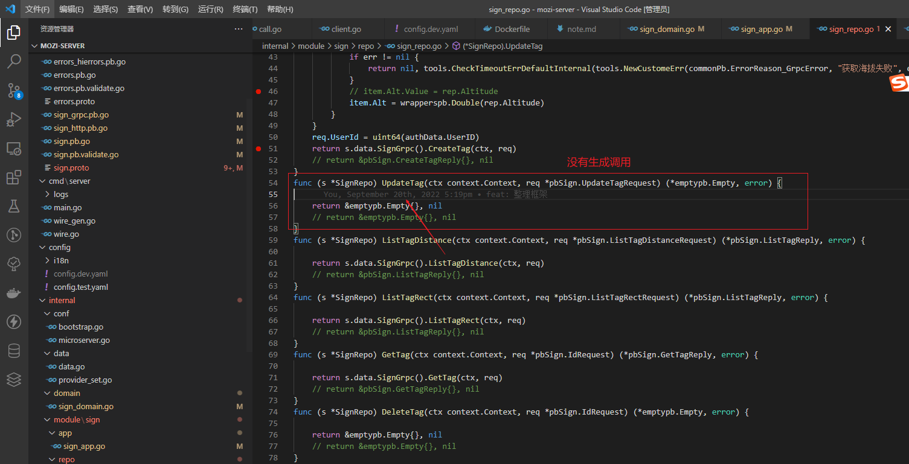

1. 

http repo

servic 也一样, 都是update没有实现

2.
http Register.go 会重复
//Code generated by createService. (语句已存在则不覆盖).
	pb.RegisterDeviceHTTPServer(srv, s.Device)
	//Code generated by createService. (语句已存在则不覆盖).
	pb.RegisterDeviceHTTPServer(srv, s.Device)